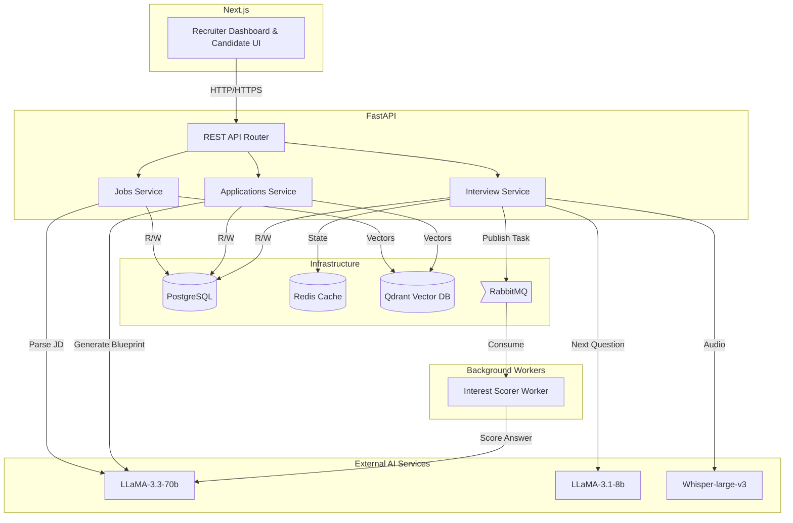
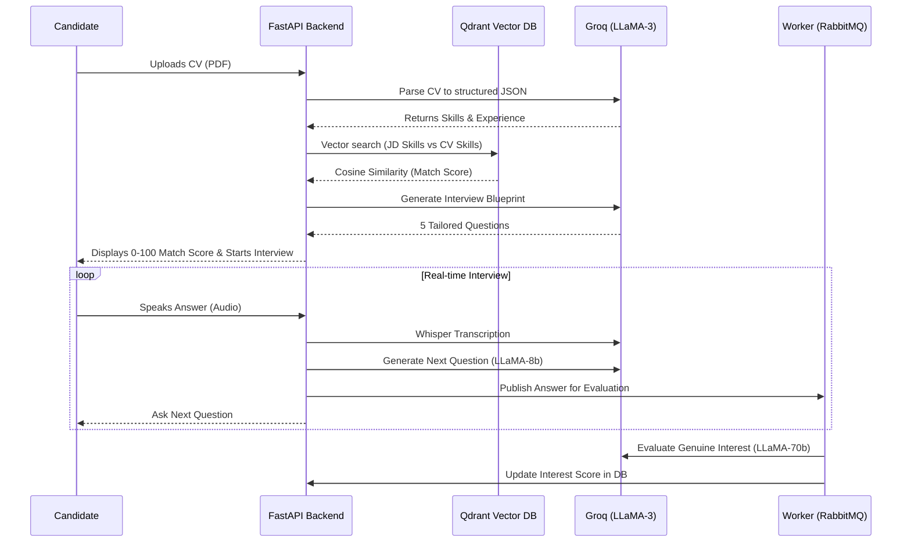

# TalentScope 🎯 

**An AI-Powered Talent Scouting Agent**

TalentScope is a full-stack, autonomous recruitment platform built to revolutionize the initial stages of hiring. By leveraging high-speed LLMs (Groq / LLaMA-3), vector embeddings, and real-time voice synthesis, TalentScope autonomously screens candidates, conducts voice-based interviews, and provides recruiters with actionable, data-driven insights.

## 🚀 Live Demo
**Prototype URL:** [https://talentscope.centralindia.cloudapp.azure.com](https://talentscope.centralindia.cloudapp.azure.com)
*(Note: Please accept the self-signed certificate warning to access the secure HTTPS site, which is required for microphone access).*

---

## 📖 Complete Documentation
For an in-depth look at our microservice architecture, API design, event-driven background workers, and semantic matching logic, please refer to our comprehensive technical documentation:
👉 **[View Full Project Documentation (Architecture, Data Flow, Schemas)](./Project_Documentation.md)**

---

## 🏗️ System Architecture



---

## ✨ Key Features

### For Recruiters:
- **Smart JD Parsing:** Upload a Job Description (PDF or text). TalentScope's heavy LLM (LLaMA-3.3-70b) parses it, enforces quality guardrails (e.g., rejecting JDs without salary info), and extracts core requirements.
- **Semantic Skill Matching:** Move beyond keyword searches. TalentScope converts JD requirements and candidate CVs into vector embeddings using `all-MiniLM-L6-v2` and searches via Qdrant to calculate a true semantic match score (0-100).
- **Skill Gap Analysis:** Instantly see which required skills a candidate lacks, along with AI-estimated upskilling timeframes.
- **Autonomous Screening:** Review candidates ranked not just by their CV, but by their *Interest Score*—evaluated by an AI after conducting a voice interview.

### For Candidates:
- **Seamless Application:** Simply upload a CV. 
- **Interactive Voice Interview:** Participate in an autonomous, conversational screening interview.
  - Answers are transcribed in real-time using **Whisper-large-v3**.
  - Follow-up questions are generated instantly using **LLaMA-3.1-8b** (optimized for low latency), maintaining conversation context via Redis.

---

## 🧠 How the AI Logic & Scoring Works



### 1. Match Score (Semantic Similarity)
We discarded naive keyword matching. When a candidate applies:
1. Their CV skills are embedded into high-dimensional vectors.
2. We query **Qdrant** (our Vector Database) against the job's stored embeddings.
3. Cosine similarity calculates a match score. *Result: A candidate knowing "PostgreSQL" will successfully match a JD requiring "Relational Databases".*

### 2. Interest Score (Hybrid NLP + LLM Evaluation)
LLM scoring can be subjective. We use a hybrid approach to evaluate a candidate's genuine interest and role alignment:
1. As the interview progresses, a RabbitMQ background worker (`interest_scorer`) analyzes answers asynchronously.
2. **Deterministic NLP:** `TextBlob` and regex extract hard signals (Sentiment Polarity, Word Count, Salary/Notice Period mentions, Repetition flags).
3. **LLM Evaluation:** These signals ground a strict prompt sent to LLaMA-3.3-70b, which outputs a final score (0-100) and a brief justification, preventing hallucination.

### 3. Prompt Injection Guardrails
Candidate audio input is sanitized using regex patterns to strip common injection phrases (e.g., *"ignore previous instructions"*), ensuring the integrity of the evaluation worker.

---

## 🛠️ Technology Stack

- **Frontend:** Next.js 14, Tailwind CSS, React Server Components
- **Backend:** Python 3.11, FastAPI, SQLAlchemy (Async)
- **AI / Inference:** Groq API (LLaMA-3.3-70b, LLaMA-3.1-8b, Whisper-large-v3)
- **Embeddings:** Sentence-Transformers (`all-MiniLM-L6-v2` - CPU Optimized)
- **Databases & State:** PostgreSQL 15, Redis 7, Qdrant
- **Event Driven:** RabbitMQ 3
- **Infrastructure:** Docker Compose, Azure VM, Nginx

---

## 💻 Local Setup Instructions

1. **Clone the repository:**
   ```bash
   git clone https://github.com/vishnuvardhanreddythornala/AI-Powered-Talent-Scouting-Agent.git
   cd AI-Powered-Talent-Scouting-Agent
   ```

2. **Set up Environment Variables:**
   - Create `backend/.env`:
     ```env
     GROQ_API_KEY=your_groq_api_key_here
     FRONTEND_URL=http://localhost:3000
     ```
   - Create `frontend/.env.local`:
     ```env
     NEXT_PUBLIC_API_URL=http://localhost:8000
     ```

3. **Start the Infrastructure (Docker):**
   ```bash
   docker compose up -d
   ```
   *This single command builds the FastAPI backend, background workers, and Next.js frontend, while spinning up Postgres, Redis, RabbitMQ, and Qdrant.*

4. **Access the Application:**
   - App: `http://localhost:3000`
   - API Docs: `http://localhost:8000/docs`

---
*Built with ❤️ for the Hackathon*
